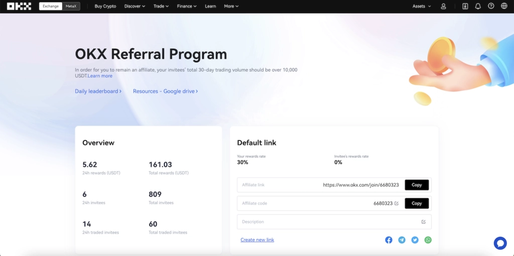

# OKX Referral Code: Get 60% Fee Discount with 47044926

---

Looking for the best way to start trading crypto while saving money? The OKX referral code **47044926** gets you a 60% discount on trading fees when you sign up. Whether you're new to crypto or moving from another exchange, this welcome bonus helps you keep more of your profits from day one.

---

## What You Get with Referral Code 47044926

Here's what you're getting when you use **47044926**:

| Feature | Details |
|---------|---------|
| 👉 **Platform** | OKX Exchange |
| **➡️ Referral Code** | 47044926 |
| **💰 Bonus** | 60% Fee Discount |
| **✅ Valid** | October 2025 |

The code is simple. Type **47044926** when creating your account, and you'll immediately qualify for the fee discount. Only new users can claim this—if you already have an OKX account, this won't work.

## How to Claim Your Welcome Bonus

Getting the bonus takes about five minutes. Here's how it works:

First, go to the OKX website and click the sign-up button at the top of the page. You'll see a registration form asking for your email and password.

Fill everything out carefully. Double-check your email address because that's where your verification link goes.

When you see the referral code field, type in **47044926**. This is the important part—without it, you won't get the fee discount.

Complete the KYC verification. They'll ask for some ID documents. This is standard stuff for any legitimate crypto exchange.

Once verification is done, your bonus activates automatically. You'll see it reflected in your trading fees right away.

👉 [Start saving 60% on trading fees with this exclusive OKX welcome offer](https://www.okx.com/join/47044926)

## The OKX Referral Program Explained

After you're signed up, you get your own referral link and code. This is where things get interesting.

You can share this link with friends, family, or anyone interested in crypto. When they sign up using your code, both of you get rewards. They get the welcome bonus, and you get a cash reward deposited directly into your account.

The system changes after you bring in five people. At that point, you become an OKX affiliate, which means better rewards. Instead of one-time cash bonuses, you start earning 30% of the trading fees generated by everyone you refer. These payments hit your account daily, not monthly or quarterly.

Think about it—if you refer someone who trades regularly, that's passive income coming in every single day. The more active traders you bring in, the more you earn.

## How the Affiliate Program Works

The affiliate program is different from the basic referral setup. Once you've got five referrals, your earning structure changes completely.

Your referrals still get their welcome bonuses when they sign up. Nothing changes for them. But instead of getting a fixed cash reward, you earn 30% of their trading fees. Every trade they make, you get a cut.

The payments are daily. Not weekly, not monthly—daily. This means you can see your earnings grow in real-time as your referrals trade.

Some users have built significant income streams this way. If you know active traders or have an audience interested in crypto, this can add up quickly.

## What Makes OKX Different

OKX has been around since 2014, which makes it one of the older exchanges still operating. It's based in Malta, where regulations favor privacy and user control.

The platform supports over 100 cryptocurrencies with hundreds of trading pairs. You can trade BTC-ETH, stake coins for interest, or join mining pools. It's basically a complete crypto ecosystem under one roof.

OKX has two main sections: Exchange and MetaX. The Exchange handles all your trading—spot, margin, futures, everything. MetaX is their DeFi platform where you can interact with decentralized protocols and Web3 applications.

### Trading Features

The trading interface gives you everything serious traders need. Advanced charting tools, multiple order types, margin trading with up to 125x leverage, and futures contracts. 

👉 [Get started with professional trading tools and 60% lower fees](https://www.okx.com/join/47044926)

Security is tight. They use multi-signature hot wallets, cold storage with geographically distributed private keys, and anti-phishing codes in emails. Your funds are protected by multiple layers of security.

The fee structure is competitive but complex. It changes based on your trading volume and whether you're a maker or taker. The 60% discount from the referral code makes a real difference, especially when you're starting out.

## Why Use Code 47044926

The promo code **47044926** gets you the best current offer on OKX. That 60% fee discount applies to all your trades, which adds up fast if you're trading regularly.

OKX prioritizes both security and privacy, which is rare. Most exchanges lean heavily toward one or the other. Here you get strong security without sacrificing privacy features.

The platform works for beginners and experienced traders. Simple buy/sell options for newcomers, advanced tools for pros. You can grow into the platform as you learn more about crypto.

Plus, the referral and affiliate programs mean you can actually earn while you trade. Most exchanges don't offer this level of earning potential to regular users.

---

**Ready to start trading?** The OKX referral code **47044926** gives you immediate access to reduced trading fees and a platform trusted by millions worldwide. Whether you're making your first crypto purchase or looking for advanced trading tools, [OKX provides the features and security you need](https://www.okx.com/join/47044926) at a lower cost than most competitors. Use code **47044926** at signup to claim your 60% fee discount.
